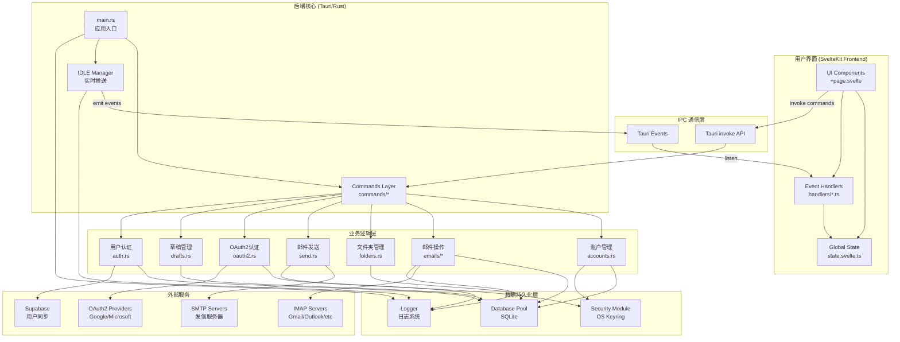
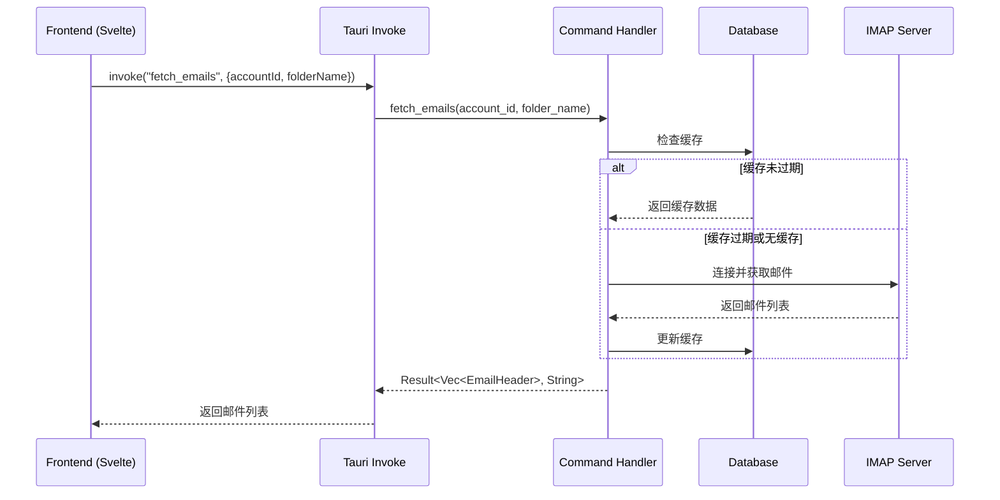
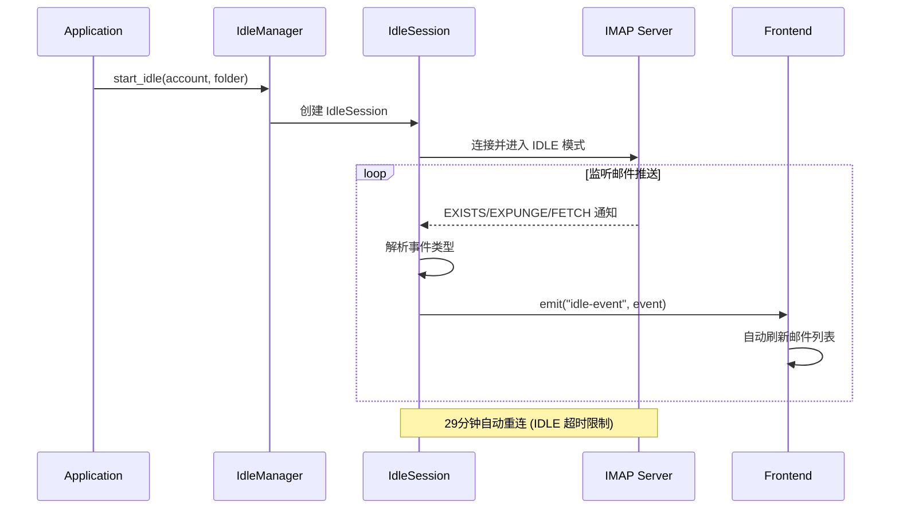
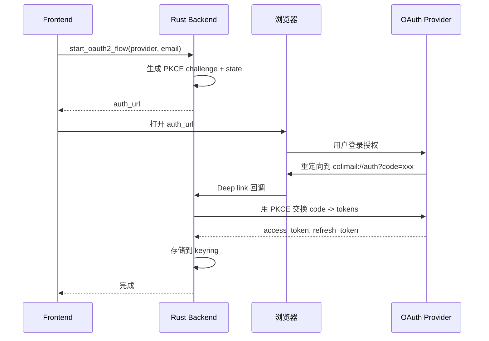
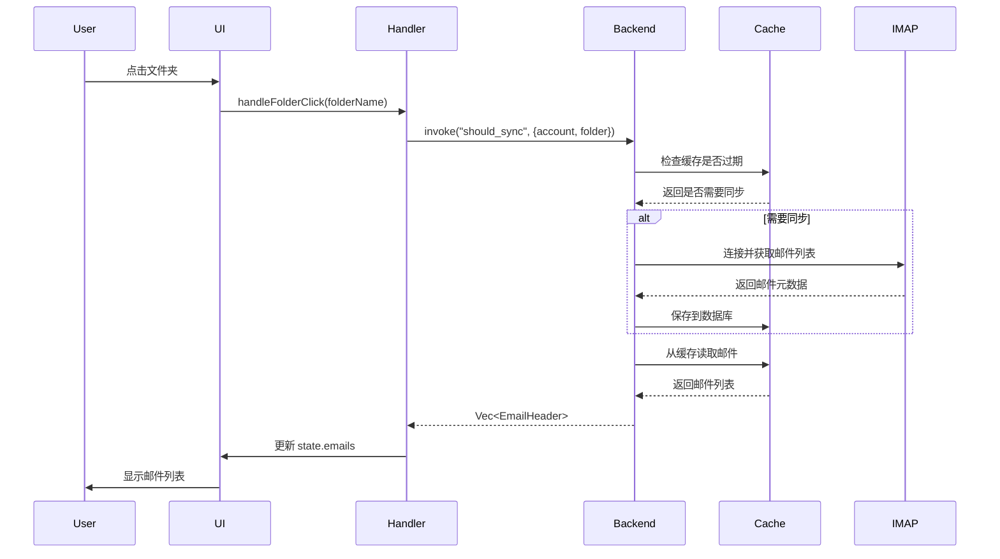
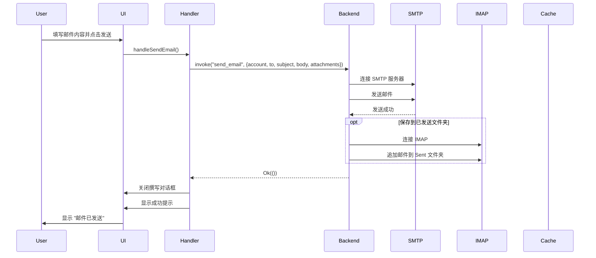
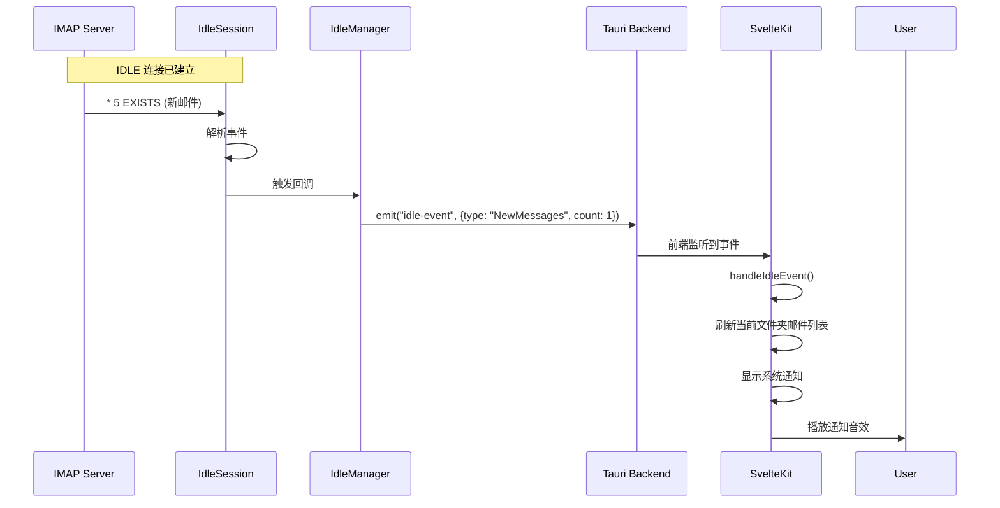
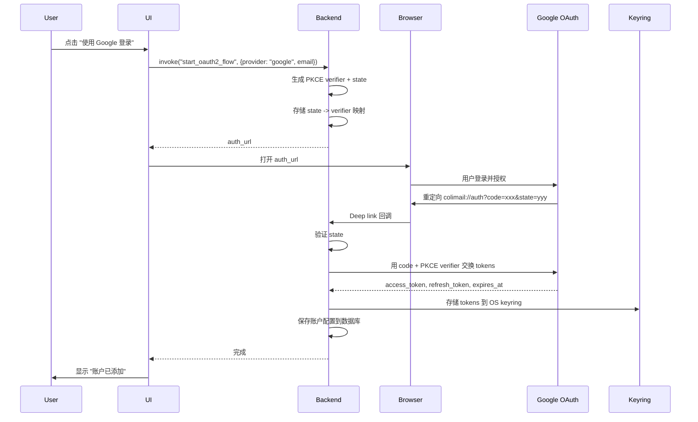

# Colimail 架构文档

本文档详细说明了 Colimail 邮箱客户端的整体架构、模块关系和数据流向。

## 目录

- [项目概览](#项目概览)
- [技术栈](#技术栈)
- [整体架构图](#整体架构图)
- [后端架构 (Rust/Tauri)](#后端架构-rusttauri)
- [前端架构 (SvelteKit)](#前端架构-sveltekit)
- [数据流向](#数据流向)
- [关键功能模块](#关键功能模块)
- [数据库设计](#数据库设计)

---

## 项目概览

**Colimail** 是一个跨平台桌面邮箱客户端,目标是创建一个轻量级、高性能的 Thunderbird 替代品。

- **前端**: SvelteKit (Svelte 5 + TypeScript)
- **后端**: Rust + Tauri 2
- **数据库**: SQLite (通过 sqlx)
- **协议**: IMAP (收信), SMTP (发信)

---

## 技术栈

### 前端
- **框架**: SvelteKit 5 (使用 runes: `$state`, `$derived`, `$effect`)
- **UI 组件**: bits-ui, shadcn-svelte
- **样式**: TailwindCSS 4
- **状态管理**: Svelte 5 runes (响应式状态)
- **构建工具**: Vite 6

### 后端
- **运行时**: Tauri 2 (桌面应用框架)
- **语言**: Rust (edition 2021)
- **异步运行时**: Tokio
- **数据库**: SQLite + sqlx (异步)
- **邮件协议**:
  - IMAP: `imap` crate (v3.0.0-alpha.15)
  - SMTP: `lettre` crate (v0.11)
- **认证**: OAuth2 (Google, Outlook) + Basic Auth
- **安全存储**: OS keyring (Windows Credential Manager, macOS Keychain, Linux Secret Service)
- **日志**: tracing + tracing-subscriber (JSON 格式,每日滚动)

---

## 整体架构图



---

## 后端架构 (Rust/Tauri)

### 1. 入口点 (main.rs)

```
src-tauri/src/main.rs
├── 初始化日志系统 (logger::init)
├── 初始化数据库 (db::init)
├── 初始化 OAuth2 凭证 (oauth2_config::init_credentials)
├── 注册 Tauri 插件
│   ├── single-instance (防止多实例)
│   ├── deep-link (处理 OAuth 回调)
│   ├── notification (系统通知)
│   ├── shell, dialog, fs, opener
├── 设置系统托盘
├── 初始化 IDLE Manager (实时邮件推送)
└── 注册所有 Tauri Commands
```

**关键功能**:
- 在启动时自动加载所有账户
- 为所有账户自动启动 IDLE 监听
- 处理深度链接 OAuth 回调 (`colimail://auth?code=...`)
- 单实例运行,第二个实例会将窗口带到前台

### 2. 数据库层 (db.rs)

```rust
// 使用 sqlx + SQLite
static POOL: OnceLock<Arc<SqlitePool>>

pub async fn init() -> Result<(), sqlx::Error>
pub fn pool() -> Arc<SqlitePool>
```

**数据表设计**:

| 表名 | 用途 | 关键字段 |
|------|------|----------|
| `accounts` | 账户配置 | id, email, imap_server, smtp_server, auth_type, display_name |
| `folders` | 文件夹列表 | id, account_id, name, display_name, is_local |
| `emails` | 邮件缓存 | id, account_id, folder_name, uid, subject, from, to, cc, body, flags, seen, flagged |
| `sync_status` | 同步状态 | account_id, folder_name, last_sync_time, uidvalidity, highest_uid |
| `settings` | 用户设置 | key, value (sync_interval, notification_enabled, etc) |
| `attachments` | 附件存储 | id, email_id, filename, content_type, size, data |
| `drafts` | 草稿箱 | id, account_id, to_addr, subject, body, draft_type, created_at |
| `app_user` | 认证用户 | id, email, subscription_tier, avatar_url |

### 3. Commands 层

Commands 层是前端调用后端的桥梁,所有 Tauri Commands 都通过 `#[command]` 宏暴露给前端。

```
src-tauri/src/commands/
├── mod.rs                    # 导出所有命令
├── accounts.rs               # 账户 CRUD (save_account_config, load_account_configs, delete_account)
├── auth.rs                   # Supabase 用户认证 (sync_app_user, get_app_user)
├── oauth2.rs                 # OAuth2 流程 (start_oauth2_flow, complete_oauth2_flow)
├── test_connection.rs        # 测试 IMAP 连接
├── detect_display_name.rs    # 从已发送邮件检测显示名称
├── emails/
│   ├── mod.rs
│   ├── fetch.rs              # 获取邮件列表/正文 (fetch_emails, fetch_email_body)
│   ├── cache.rs              # 从本地缓存加载邮件
│   ├── delete.rs             # 删除邮件 (move_email_to_trash, delete_email)
│   ├── flags.rs              # 邮件标记 (mark_as_read, mark_as_flagged)
│   ├── attachments.rs        # 附件管理 (load_attachments_info, download_attachment)
│   ├── sync/                 # 邮件同步模块
│   │   ├── mod.rs
│   │   ├── sync_core.rs      # 核心同步逻辑
│   │   ├── sync_fetch.rs     # 批量获取邮件
│   │   ├── sync_flags.rs     # 同步邮件标志
│   │   └── sync_state.rs     # 同步状态管理
│   ├── codec.rs              # 编码处理 (UTF-7, charset detection)
│   ├── imap_helpers.rs       # IMAP 工具函数
│   └── sync_interval.rs      # 同步间隔设置
├── folders.rs                # 文件夹管理 (fetch_folders, create_folder, delete_folder)
├── send.rs                   # 发送邮件 (send_email, reply_email, forward_email)
├── drafts.rs                 # 草稿管理 (save_draft, load_draft, list_drafts)
├── notifications.rs          # 通知设置
├── logs.rs                   # 日志查看
└── utils.rs                  # 工具函数 (ensure_valid_token - OAuth token 刷新)
```

**命令调用流程**:



### 4. IDLE Manager (实时推送)

```
src-tauri/src/idle_manager/
├── mod.rs          # 模块导出
├── types.rs        # IdleCommand 枚举定义
├── manager.rs      # IdleManager 主逻辑 (管理所有 IDLE 会话)
├── session.rs      # IdleSession (单个文件夹的 IDLE 连接)
└── notification.rs # 通知处理
```

**IDLE 工作原理**:



**支持的事件类型**:
- `NewMessages`: 新邮件到达
- `Expunge`: 邮件被删除
- `FlagsChanged`: 邮件标志改变 (已读/未读/标星)
- `ConnectionLost`: 连接丢失

### 5. 安全模块 (security.rs)

**功能**: 安全存储敏感凭证到操作系统密钥环

```rust
pub fn store_credentials(creds: &AccountCredentials) -> Result<(), String>
pub fn get_credentials(email: &str) -> Result<AccountCredentials, String>
pub fn delete_credentials(email: &str) -> Result<(), String>
pub fn update_credentials(...) -> Result<(), String>
```

**存储策略**:
- Windows: Windows Credential Manager
- macOS: Keychain
- Linux: Secret Service (libsecret)

**数据分片存储**:
为避免 Windows Credential Manager 的 2560 字符限制,长文本 (如 OAuth tokens) 会被分片存储:
- `{email_hash}:pwd` - 密码
- `{email_hash}:at` - access_token
- `{email_hash}:rt` - refresh_token
- `{email_hash}:exp` - token 过期时间
- `{email_hash}:count` - 分片数量
- `{email_hash}:chunk0`, `chunk1`, ... - 数据分片

### 6. OAuth2 配置 (oauth2_config.rs)

**支持的提供商**:
- Google (Gmail)
- Microsoft (Outlook/Office 365)

**OAuth2 流程**:



### 7. 日志系统 (logger.rs)

**配置**:
- **文件日志**: JSON 格式,每日滚动,保留 7 天
- **控制台日志**: 仅在 Debug 模式下启用
- **日志路径**: `{AppData}/Colimail/logs/colimail.{date}.log`

**日志级别**:
- Debug 构建: `DEBUG`
- Release 构建: `INFO`

**可通过前端查看日志** (`commands/logs.rs`):
- `read_recent_logs()` - 查看最近日志
- `list_log_files()` - 列出所有日志文件
- `read_log_file(filename)` - 读取指定日志文件

---

## 前端架构 (SvelteKit)

### 1. 路由结构

```
src/routes/
├── +page.svelte              # 主界面 (邮件列表 + 邮件正文)
├── account/+page.svelte      # 账户管理页面
├── debug/+page.svelte        # 调试页面
├── components/               # 页面组件
│   ├── AccountFolderSidebar.svelte    # 账户+文件夹侧边栏
│   ├── EmailListSidebar.svelte        # 邮件列表侧边栏
│   ├── EmailBody.svelte               # 邮件正文显示
│   ├── ComposeDialog.svelte           # 撰写邮件对话框
│   ├── AddAccountDialog.svelte        # 添加账户对话框
│   ├── ManageAccountDialog.svelte     # 管理账户对话框
│   ├── SettingsDialog.svelte          # 设置对话框
│   ├── DraftsList.svelte              # 草稿列表
│   ├── AttachmentList.svelte          # 附件列表
│   └── ...
├── handlers/                 # 业务逻辑处理器
│   ├── account-folder.ts     # 账户和文件夹操作
│   ├── email-operations.ts   # 邮件操作 (点击/删除/标记)
│   ├── compose-send.ts       # 撰写和发送邮件
│   ├── draft-management.ts   # 草稿管理
│   └── sync-idle.ts          # 同步和 IDLE 事件
└── lib/                      # 共享代码
    ├── state.svelte.ts       # 全局状态管理
    ├── types.ts              # TypeScript 类型定义
    ├── draft-manager.ts      # 草稿自动保存管理器
    ├── email-providers.ts    # 邮件提供商配置
    └── utils.ts              # 工具函数
```

### 2. 状态管理 (state.svelte.ts)

使用 Svelte 5 的 runes API 管理全局状态:

```typescript
class AppState {
  // 账户状态
  accounts = $state<AccountConfig[]>([]);
  selectedAccountId = $state<number | null>(null);

  // 文件夹状态
  folders = $state<Folder[]>([]);
  selectedFolderName = $state<string>("INBOX");

  // 邮件列表状态
  emails = $state<EmailHeader[]>([]);
  selectedEmailUid = $state<number | null>(null);

  // 分页状态
  currentPage = $state<number>(1);
  pageSize = $state<number>(50);

  // 邮件正文状态
  emailBody = $state<string | null>(null);
  attachments = $state<AttachmentInfo[]>([]);

  // 撰写邮件状态
  showComposeDialog = $state<boolean>(false);
  composeTo = $state<string>("");
  composeSubject = $state<string>("");
  composeBody = $state<string>("");
  composeAttachments = $state<File[]>([]);

  // 草稿状态
  drafts = $state<DraftListItem[]>([]);
  currentDraftId = $state<number | null>(null);

  // 同步状态
  isSyncing = $state<boolean>(false);
  syncInterval = $state<number>(300);

  // 派生状态
  totalAttachmentSize = $derived<number>(
    this.composeAttachments.reduce((sum, file) => sum + file.size, 0)
  );

  selectedEmail = $derived<EmailHeader | undefined>(
    this.emails.find((email) => email.uid === this.selectedEmailUid)
  );
}

export const state = new AppState();
```

**优点**:
- 响应式: 状态变化自动触发 UI 更新
- 类型安全: TypeScript 提供完整类型提示
- 派生状态: 自动计算依赖状态

### 3. Handlers 层 (业务逻辑)

Handlers 层将业务逻辑从组件中分离出来,提高代码可维护性:

```
handlers/
├── account-folder.ts
│   ├── handleAccountClick()         # 切换账户
│   ├── handleFolderClick()          # 切换文件夹
│   ├── loadEmailsForFolder()        # 加载文件夹邮件
│   ├── handleAccountAdded()         # 添加账户后刷新
│   └── handleAccountDeleted()       # 删除账户后刷新
│
├── email-operations.ts
│   ├── handleEmailClick()           # 点击邮件,加载正文
│   ├── handleToggleReadStatus()     # 切换已读/未读
│   ├── handleStarToggle()           # 切换标星
│   ├── handleDeleteEmail()          # 删除邮件
│   └── downloadAttachment()         # 下载附件
│
├── compose-send.ts
│   ├── handleComposeClick()         # 打开撰写对话框
│   ├── handleReplyClick()           # 回复邮件
│   ├── handleForwardClick()         # 转发邮件
│   ├── handleSendEmail()            # 发送邮件
│   ├── handleAttachmentSelect()     # 选择附件
│   └── updateAttachmentSizeLimit()  # 更新附件大小限制
│
├── draft-management.ts
│   ├── autoSaveDraft()              # 自动保存草稿
│   ├── handleSaveDraft()            # 手动保存草稿
│   ├── handleDraftClick()           # 打开草稿
│   ├── handleDraftDelete()          # 删除草稿
│   └── loadDrafts()                 # 加载草稿列表
│
└── sync-idle.ts
    ├── handleManualRefresh()        # 手动刷新
    ├── handleIdleEvent()            # 处理 IDLE 推送事件
    ├── startAutoSyncTimer()         # 启动自动同步定时器
    └── playNotificationSound()      # 播放通知音效
```

### 4. 组件架构

主界面由三个主要区域组成:

```
┌─────────────────────────────────────────────────────────┐
│  AccountFolderSidebar                                   │
│  ┌─────────────────┐                                    │
│  │ Account Selector│                                    │
│  ├─────────────────┤                                    │
│  │ • INBOX         │                                    │
│  │ • Sent          │                                    │
│  │ • Drafts        │                                    │
│  │ • Trash         │                                    │
│  └─────────────────┘                                    │
├─────────────────────┬───────────────────────────────────┤
│ EmailListSidebar    │ EmailBody                         │
│                     │                                   │
│ ☑ Email Subject 1   │ From: sender@example.com          │
│ ☐ Email Subject 2   │ To: recipient@example.com         │
│ ☐ Email Subject 3   │ Subject: RE: Important Topic      │
│                     │                                   │
│ [← Prev] [Next →]   │ <Email HTML content here>         │
│                     │                                   │
│                     │ 📎 Attachments:                   │
│                     │    - document.pdf (1.2 MB)        │
│                     │                                   │
│                     │ [Reply] [Forward] [Delete]        │
└─────────────────────┴───────────────────────────────────┘
```

**组件职责**:

- `AccountFolderSidebar`: 账户切换、文件夹导航、新建邮件、同步
- `EmailListSidebar`: 邮件列表、分页、搜索、右键菜单
- `EmailBody`: 邮件正文显示、附件下载、回复/转发/删除
- `ComposeDialog`: 撰写邮件、添加附件、发送
- `AddAccountDialog`: 添加账户 (Basic Auth / OAuth2)
- `SettingsDialog`: 应用设置 (同步间隔、通知、托盘)

### 5. 前后端通信

**调用后端命令**:

```typescript
import { invoke } from "@tauri-apps/api/core";

// 示例: 获取邮件列表
const emails = await invoke<EmailHeader[]>("fetch_emails", {
  accountId: 1,
  folderName: "INBOX"
});

// 示例: 发送邮件
await invoke("send_email", {
  accountId: 1,
  to: "recipient@example.com",
  subject: "Hello",
  body: "<p>Email body</p>",
  attachments: []
});
```

**监听后端事件**:

```typescript
import { listen } from "@tauri-apps/api/event";

// 监听 IDLE 推送事件
const unlisten = await listen("idle-event", (event) => {
  const idleEvent = event.payload as IdleEvent;
  console.log("New message arrived:", idleEvent);
  // 刷新邮件列表
  loadEmailsForFolder(idleEvent.folder_name);
});

// 监听通知音效事件
await listen("play-notification-sound", () => {
  const audio = new Audio("/notification.mp3");
  audio.play();
});
```

---

## 数据流向

### 1. 获取邮件列表流程



### 2. 发送邮件流程



### 3. IDLE 实时推送流程



### 4. OAuth2 认证流程



---

## 关键功能模块

### 1. 邮件同步策略

**增量同步** (Incremental Sync):
- 使用 `uidvalidity` 检测文件夹是否重置
- 使用 `highest_uid` 记录最后同步的邮件 UID
- 每次只同步 `UID > highest_uid` 的新邮件
- 定期同步邮件标志 (已读/未读/标星)

**同步触发条件**:
1. 用户手动刷新
2. 切换文件夹
3. 自动同步定时器 (默认 5 分钟)
4. IDLE 推送通知

**缓存策略**:
- 邮件元数据 (subject, from, date) 永久缓存
- 邮件正文按需获取,缓存到数据库
- 附件按需下载,存储在数据库

### 2. 草稿自动保存

**自动保存机制**:
- 用户输入后 3 秒自动保存
- 使用 debounce 避免频繁保存
- 保存时不打断用户输入
- 关闭撰写对话框时提示保存

**草稿类型**:
- `compose`: 新建邮件
- `reply`: 回复邮件
- `forward`: 转发邮件

### 3. 附件管理

**附件存储**:
- 下载的附件存储在数据库 BLOB 字段
- 前端显示附件信息 (文件名、大小、类型)
- 支持保存到本地文件系统

**附件大小限制**:
- 根据 SMTP 服务器限制动态调整
- Google: 25 MB
- Outlook: 20 MB
- 其他: 10 MB

### 4. 多账户支持

**账户管理**:
- 支持同时登录多个账户
- 支持 Basic Auth 和 OAuth2
- 每个账户独立的 IDLE 连接
- 切换账户时自动加载对应文件夹

**凭证存储**:
- 非敏感数据 (服务器地址、端口) 存储在 SQLite
- 敏感数据 (密码、tokens) 存储在 OS keyring
- OAuth2 tokens 自动刷新

### 5. 通知系统

**系统通知**:
- 新邮件到达时显示系统通知
- 可选通知音效
- 支持 Windows/macOS/Linux 原生通知

**配置选项**:
- 启用/禁用通知
- 启用/禁用音效
- 最小化到托盘设置

---

## 数据库设计

### 核心表结构

#### accounts 表

| 字段 | 类型 | 说明 |
|------|------|------|
| id | INTEGER PRIMARY KEY | 账户 ID |
| email | TEXT NOT NULL UNIQUE | 邮箱地址 |
| imap_server | TEXT NOT NULL | IMAP 服务器 |
| imap_port | INTEGER NOT NULL | IMAP 端口 |
| smtp_server | TEXT NOT NULL | SMTP 服务器 |
| smtp_port | INTEGER NOT NULL | SMTP 端口 |
| auth_type | TEXT NOT NULL | 认证类型 (basic/oauth2) |
| display_name | TEXT | 显示名称 |
| app_user_id | TEXT | Supabase 用户 ID |

#### emails 表

| 字段 | 类型 | 说明 |
|------|------|------|
| id | INTEGER PRIMARY KEY | 邮件 ID |
| account_id | INTEGER NOT NULL | 所属账户 |
| folder_name | TEXT NOT NULL | 所属文件夹 |
| uid | INTEGER NOT NULL | IMAP UID |
| subject | TEXT NOT NULL | 主题 |
| from_addr | TEXT NOT NULL | 发件人 |
| to_addr | TEXT NOT NULL | 收件人 |
| cc_addr | TEXT | 抄送 |
| date | TEXT NOT NULL | 日期字符串 |
| timestamp | INTEGER NOT NULL | Unix 时间戳 |
| body | TEXT | 邮件正文 (HTML) |
| has_attachments | INTEGER DEFAULT 0 | 是否有附件 |
| flags | TEXT | IMAP 标志 |
| seen | INTEGER DEFAULT 0 | 已读标志 |
| flagged | INTEGER DEFAULT 0 | 标星标志 |
| synced_at | INTEGER NOT NULL | 同步时间 |

**索引**:
```sql
CREATE INDEX idx_emails_account_folder
ON emails(account_id, folder_name, timestamp DESC);
```

#### folders 表

| 字段 | 类型 | 说明 |
|------|------|------|
| id | INTEGER PRIMARY KEY | 文件夹 ID |
| account_id | INTEGER NOT NULL | 所属账户 |
| name | TEXT NOT NULL | IMAP 文件夹名 (UTF-7) |
| display_name | TEXT NOT NULL | 显示名称 (UTF-8) |
| delimiter | TEXT | 层级分隔符 |
| flags | TEXT | IMAP 标志 |
| is_local | INTEGER DEFAULT 0 | 是否为本地文件夹 |

**唯一约束**:
```sql
UNIQUE(account_id, name)
```

#### sync_status 表

| 字段 | 类型 | 说明 |
|------|------|------|
| id | INTEGER PRIMARY KEY | 记录 ID |
| account_id | INTEGER NOT NULL | 账户 ID |
| folder_name | TEXT NOT NULL | 文件夹名 |
| last_sync_time | INTEGER NOT NULL | 最后同步时间 |
| uidvalidity | INTEGER | UIDVALIDITY |
| highest_uid | INTEGER | 最高 UID |

#### attachments 表

| 字段 | 类型 | 说明 |
|------|------|------|
| id | INTEGER PRIMARY KEY | 附件 ID |
| email_id | INTEGER NOT NULL | 所属邮件 |
| filename | TEXT NOT NULL | 文件名 |
| content_type | TEXT NOT NULL | MIME 类型 |
| size | INTEGER NOT NULL | 文件大小 (字节) |
| data | BLOB NOT NULL | 附件数据 |

#### drafts 表

| 字段 | 类型 | 说明 |
|------|------|------|
| id | INTEGER PRIMARY KEY | 草稿 ID |
| account_id | INTEGER NOT NULL | 账户 ID |
| to_addr | TEXT NOT NULL | 收件人 |
| cc_addr | TEXT | 抄送 |
| subject | TEXT NOT NULL | 主题 |
| body | TEXT NOT NULL | 正文 |
| attachments | TEXT | 附件 (JSON) |
| draft_type | TEXT NOT NULL | 类型 (compose/reply/forward) |
| original_email_id | INTEGER | 原邮件 ID (回复/转发时) |
| created_at | INTEGER NOT NULL | 创建时间 |
| updated_at | INTEGER NOT NULL | 更新时间 |

#### settings 表

| 字段 | 类型 | 说明 |
|------|------|------|
| key | TEXT PRIMARY KEY | 设置键 |
| value | TEXT NOT NULL | 设置值 |

**常用设置**:
- `sync_interval`: 同步间隔 (秒)
- `notification_enabled`: 是否启用通知
- `sound_enabled`: 是否启用音效
- `minimize_to_tray`: 是否最小化到托盘

---

## 性能优化

### 1. 数据库优化
- 使用索引加速查询
- 邮件列表分页加载 (每页 50 封)
- 邮件正文按需加载

### 2. IMAP 连接管理
- 连接池复用
- IDLE 连接自动重连
- 批量操作减少往返次数

### 3. 前端优化
- 虚拟滚动 (大邮件列表)
- 图片懒加载
- 组件按需加载

### 4. 并发处理
- 使用 `tokio::task::spawn_blocking` 处理阻塞操作
- IMAP/SMTP 操作在独立线程
- 数据库操作异步化 (sqlx)

---

## 安全考虑

1. **凭证存储**: 使用 OS keyring 加密存储
2. **TLS 连接**: IMAP/SMTP 强制使用 TLS
3. **OAuth2**: 使用 PKCE 防止授权码拦截
4. **SQL 注入**: 使用参数化查询
5. **XSS 防护**: 邮件 HTML 渲染需要 sanitize

---

## 未来扩展方向

1. **搜索功能**: 全文搜索、高级过滤
2. **邮件规则**: 自动分类、标记
3. **签名和加密**: PGP/S/MIME 支持
4. **日历集成**: CalDAV 支持
5. **联系人管理**: CardDAV 支持
6. **主题定制**: 自定义 UI 主题
7. **插件系统**: 扩展功能

---

## 开发指南

### 添加新的 Tauri Command

1. 在 `src-tauri/src/models.rs` 定义数据结构
2. 在 `src-tauri/src/commands/*.rs` 实现命令函数
3. 在 `src-tauri/src/commands/mod.rs` 导出函数
4. 在 `src-tauri/src/main.rs` 的 `invoke_handler` 中注册
5. 在前端调用: `invoke("command_name", { ...params })`

### 添加新的 UI 组件

1. 在 `src/routes/components/*.svelte` 创建组件
2. 在 `src/routes/lib/types.ts` 定义类型
3. 在 `src/routes/lib/state.svelte.ts` 添加状态 (如需要)
4. 在 `src/routes/handlers/*.ts` 实现业务逻辑
5. 在 `+page.svelte` 中引用组件

### 调试技巧

1. **后端日志**: 查看 `{AppData}/Colimail/logs/` 下的日志文件
2. **前端控制台**: 使用 `console.log` 或浏览器开发工具
3. **Rust 断点**: 使用 `dbg!()` 宏或调试器
4. **数据库查看**: 使用 DB Browser for SQLite 查看数据库

---

## 项目文件结构总览

```
maildesk/
├── src/                          # 前端代码 (SvelteKit)
│   ├── routes/
│   │   ├── +page.svelte          # 主界面
│   │   ├── components/           # UI 组件
│   │   ├── handlers/             # 业务逻辑
│   │   └── lib/                  # 共享代码
│   │       ├── state.svelte.ts   # 全局状态
│   │       └── types.ts          # 类型定义
│   └── lib/
│       └── components/ui/        # shadcn UI 组件库
│
├── src-tauri/                    # 后端代码 (Rust)
│   ├── src/
│   │   ├── main.rs               # 应用入口
│   │   ├── db.rs                 # 数据库
│   │   ├── models.rs             # 数据模型
│   │   ├── security.rs           # 安全模块
│   │   ├── oauth2_config.rs      # OAuth2 配置
│   │   ├── logger.rs             # 日志系统
│   │   ├── idle_manager/         # IDLE 推送
│   │   │   ├── mod.rs
│   │   │   ├── manager.rs
│   │   │   ├── session.rs
│   │   │   └── notification.rs
│   │   └── commands/             # Tauri Commands
│   │       ├── mod.rs
│   │       ├── accounts.rs
│   │       ├── auth.rs
│   │       ├── oauth2.rs
│   │       ├── emails/
│   │       │   ├── mod.rs
│   │       │   ├── fetch.rs
│   │       │   ├── sync/
│   │       │   └── ...
│   │       ├── folders.rs
│   │       ├── send.rs
│   │       └── drafts.rs
│   ├── Cargo.toml                # Rust 依赖
│   └── tauri.conf.json           # Tauri 配置
│
├── package.json                  # Node 依赖
├── svelte.config.js              # SvelteKit 配置
├── vite.config.js                # Vite 配置
├── tailwind.config.js            # TailwindCSS 配置
├── CLAUDE.md                     # Claude Code 项目说明
├── ARCHITECTURE.md               # 本架构文档
└── CHANGELOG.md                  # 更新日志
```

---

## 总结

Colimail 采用现代化的技术栈,通过 Tauri 将 Rust 的高性能与 SvelteKit 的优雅 UI 完美结合:

- **清晰的分层架构**: UI 层、业务逻辑层、数据持久化层分离
- **响应式设计**: 使用 Svelte 5 runes 实现响应式状态管理
- **实时推送**: IDLE Manager 提供毫秒级邮件推送通知
- **安全可靠**: OS keyring 存储敏感信息,OAuth2 认证
- **高性能**: Rust 后端 + SQLite 本地缓存,快速响应
- **可扩展**: 模块化设计,易于添加新功能

本架构文档旨在帮助新开发者快速理解项目结构,定位代码位置,理解数据流向。建议结合 `CLAUDE.md` 和源代码一起阅读。
