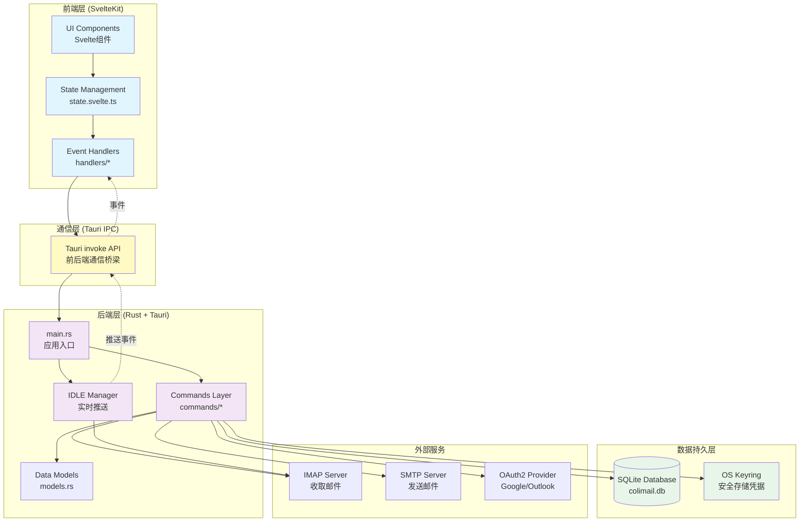
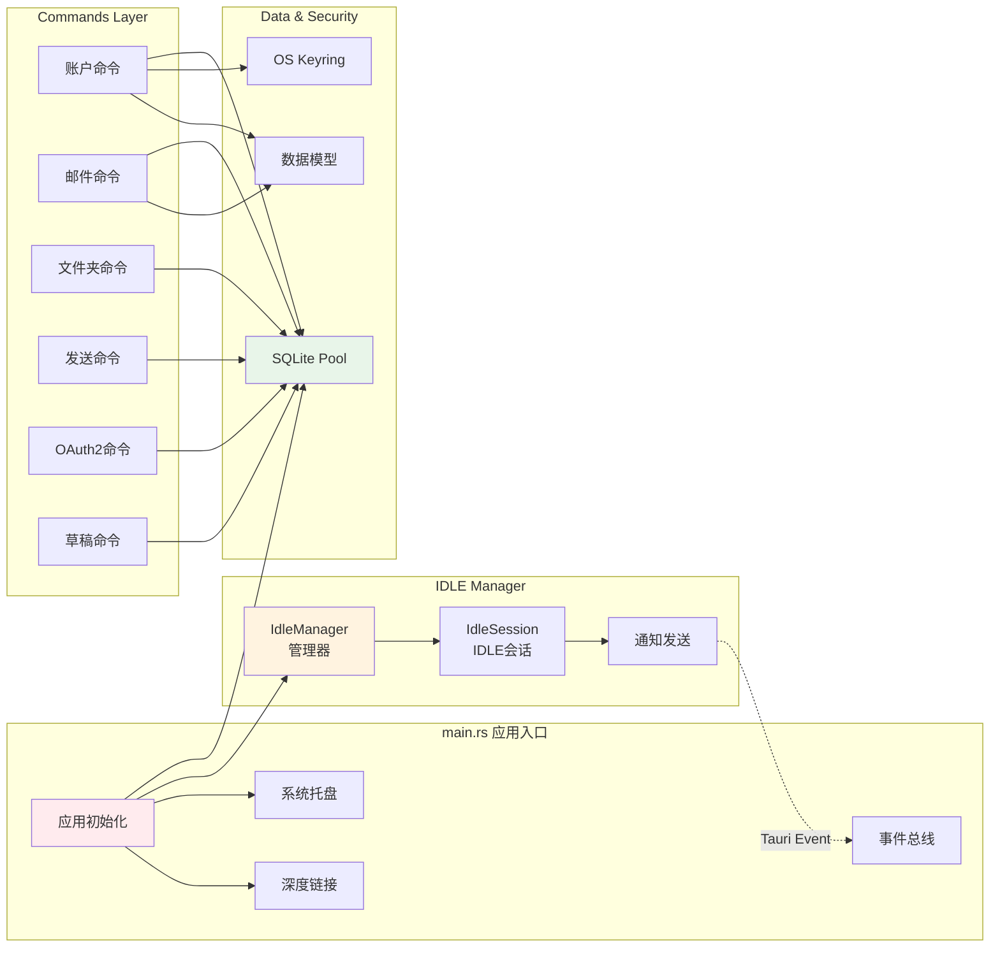
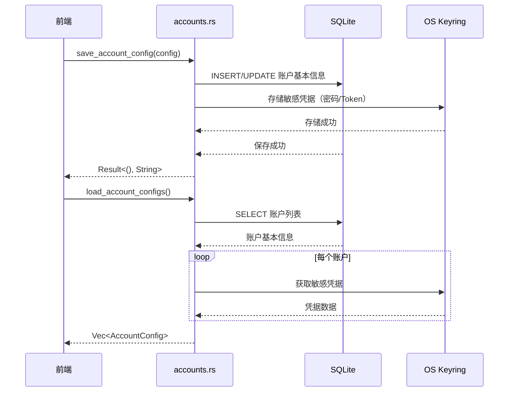
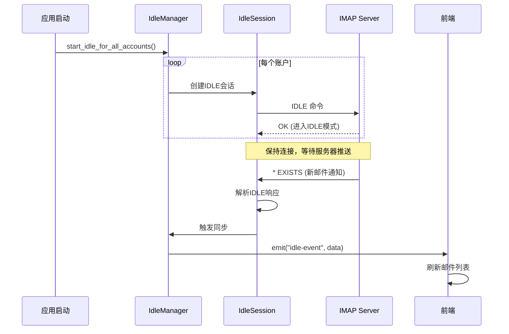
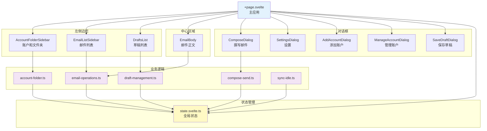
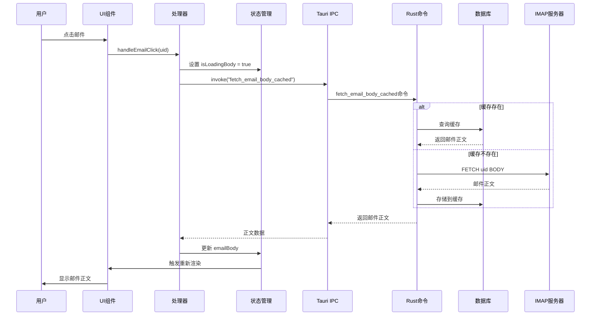
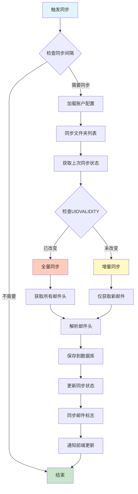
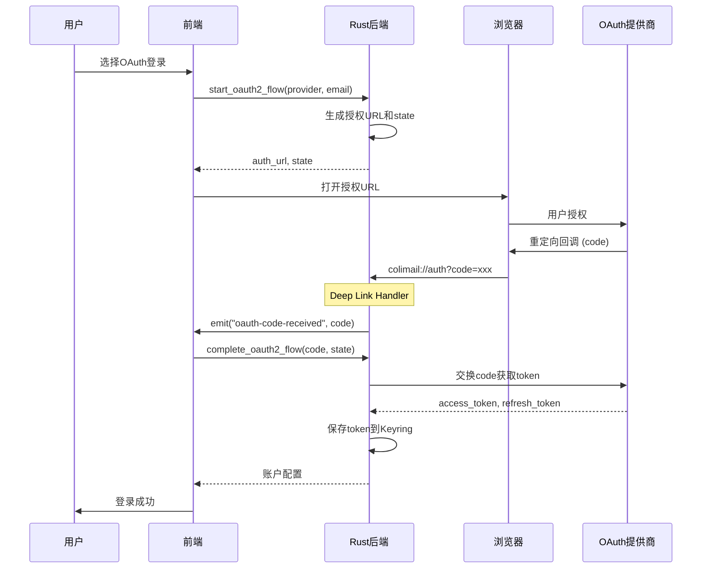
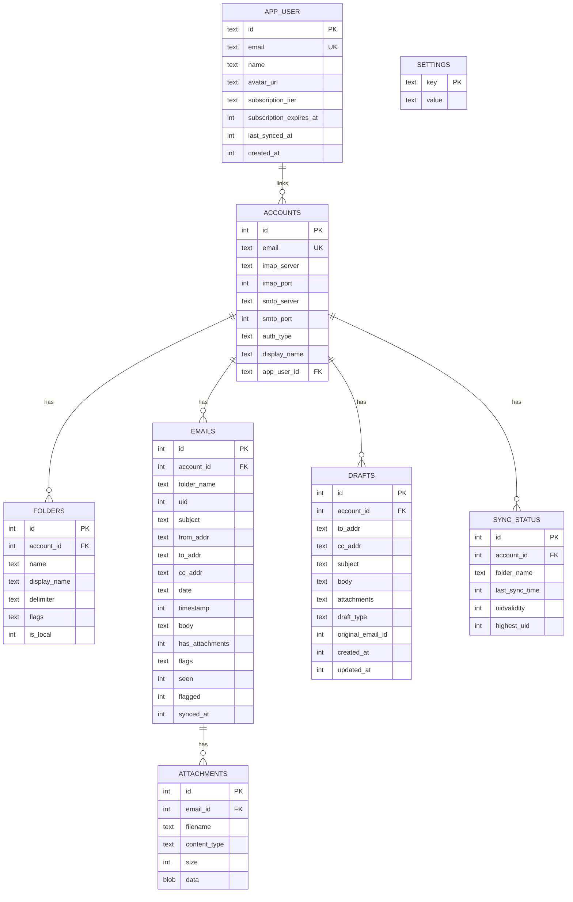

# Colimail 架构文档

> 本文档提供Colimail邮箱客户端的完整架构概览，帮助新开发者快速理解项目结构和各组件关系。

## 目录
- [项目概览](#项目概览)
- [整体架构](#整体架构)
- [后端架构（Rust + Tauri）](#后端架构rust--tauri)
- [前端架构（SvelteKit + TypeScript）](#前端架构sveltekit--typescript)
- [数据流详解](#数据流详解)
- [核心功能模块](#核心功能模块)
- [数据库设计](#数据库设计)
- [关键技术点](#关键技术点)

---

## 项目概览

**Colimail** 是一个跨平台的轻量级邮箱桌面客户端，旨在提供高性能、低资源消耗的邮件管理体验。

### 技术栈
- **前端**: SvelteKit (Svelte 5 with runes) + TypeScript
- **后端**: Rust + Tauri 2
- **数据库**: SQLite (通过 sqlx)
- **邮件协议**: IMAP (imap crate) + SMTP (lettre)
- **UI 组件**: shadcn-svelte
- **状态管理**: Svelte 5 runes ($state, $derived, $effect)

---

## 整体架构



---

## 后端架构（Rust + Tauri）

### 1. 核心模块结构

```
src-tauri/src/
├── main.rs                    # 应用程序入口
├── db.rs                      # 数据库初始化和连接池
├── models.rs                  # 数据模型定义
├── security.rs                # 凭据安全存储（OS Keyring）
├── oauth2_config.rs           # OAuth2配置
├── logger.rs                  # 日志系统
├── attachment_limits.rs       # 附件大小限制
├── commands/                  # Tauri命令层
│   ├── mod.rs                # 命令导出
│   ├── accounts.rs           # 账户管理
│   ├── emails/               # 邮件操作模块
│   │   ├── mod.rs
│   │   ├── fetch.rs          # 邮件获取
│   │   ├── sync/             # 邮件同步子模块
│   │   │   ├── mod.rs
│   │   │   ├── sync_core.rs  # 核心同步逻辑
│   │   │   ├── sync_fetch.rs # 同步获取
│   │   │   ├── sync_flags.rs # 标志同步
│   │   │   ├── sync_state.rs # 同步状态
│   │   │   └── parse.rs      # 邮件解析
│   │   ├── cache.rs          # 邮件缓存
│   │   ├── flags.rs          # 邮件标志（已读/星标）
│   │   ├── delete.rs         # 邮件删除
│   │   ├── attachments.rs    # 附件管理
│   │   ├── imap_helpers.rs   # IMAP辅助函数
│   │   ├── codec.rs          # 编码处理
│   │   ├── fetch_bodystructure.rs
│   │   └── sync_interval.rs  # 同步间隔设置
│   ├── folders.rs            # 文件夹管理
│   ├── send.rs               # 邮件发送
│   ├── oauth2.rs             # OAuth2认证流程
│   ├── drafts.rs             # 草稿管理
│   ├── auth.rs               # 应用用户认证
│   ├── test_connection.rs    # 连接测试
│   ├── logs.rs               # 日志管理
│   ├── notifications.rs      # 通知设置
│   ├── detect_display_name.rs
│   └── utils.rs              # 工具函数
└── idle_manager/             # IMAP IDLE管理器
    ├── mod.rs                # 模块导出
    ├── manager.rs            # IDLE管理器主逻辑
    ├── session.rs            # IDLE会话
    ├── notification.rs       # 推送通知
    └── types.rs              # IDLE类型定义
```

### 2. 后端核心组件关系



### 3. 关键后端流程

#### 账户管理流程


#### IMAP IDLE 实时推送流程


---

## 前端架构（SvelteKit + TypeScript）

### 1. 前端目录结构

```
src/
├── routes/                    # SvelteKit路由
│   ├── +page.svelte          # 主应用页面
│   ├── +layout.ts            # 布局配置
│   ├── account/              # 账户页面
│   ├── components/           # 页面组件
│   │   ├── AccountFolderSidebar.svelte
│   │   ├── EmailListSidebar.svelte
│   │   ├── EmailBody.svelte
│   │   ├── ComposeDialog.svelte
│   │   ├── SettingsDialog.svelte
│   │   ├── AddAccountDialog.svelte
│   │   ├── DraftsList.svelte
│   │   └── ...
│   ├── handlers/             # 业务逻辑处理器
│   │   ├── email-operations.ts      # 邮件操作
│   │   ├── account-folder.ts        # 账户和文件夹
│   │   ├── compose-send.ts          # 撰写和发送
│   │   ├── draft-management.ts      # 草稿管理
│   │   └── sync-idle.ts             # 同步和IDLE
│   └── lib/                  # 工具和类型
│       ├── state.svelte.ts   # 全局状态管理
│       ├── types.ts          # TypeScript类型
│       ├── utils.ts          # 工具函数
│       ├── draft-manager.ts  # 草稿管理器
│       └── email-providers.ts
├── lib/                      # 共享库
│   ├── components/           # 通用UI组件
│   │   └── ui/              # shadcn-svelte组件
│   ├── utils.ts
│   ├── supabase.ts          # Supabase集成
│   └── stores/
│       └── auth.svelte.ts   # 认证状态
└── main.ts                   # 应用入口
```

### 2. 前端组件层次



### 3. 状态管理（Svelte 5 Runes）

```typescript
// state.svelte.ts 核心状态
class AppState {
  // 账户状态
  accounts = $state<AccountConfig[]>([])
  selectedAccountId = $state<number | null>(null)

  // 文件夹状态
  folders = $state<Folder[]>([])
  selectedFolderName = $state<string>("INBOX")

  // 邮件列表状态
  emails = $state<EmailHeader[]>([])
  selectedEmailUid = $state<number | null>(null)

  // 邮件正文状态
  emailBody = $state<string | null>(null)
  attachments = $state<AttachmentInfo[]>([])

  // 撰写对话框状态
  showComposeDialog = $state<boolean>(false)
  composeTo = $state<string>("")
  composeSubject = $state<string>("")
  composeBody = $state<string>("")
  composeAttachments = $state<File[]>([])

  // 草稿状态
  drafts = $state<DraftListItem[]>([])
  currentDraftId = $state<number | null>(null)

  // 同步状态
  isSyncing = $state<boolean>(false)
  syncInterval = $state<number>(300)

  // 派生状态
  selectedEmail = $derived(
    this.emails.find(e => e.uid === this.selectedEmailUid)
  )

  totalAttachmentSize = $derived(
    this.composeAttachments.reduce((sum, f) => sum + f.size, 0)
  )
}
```

---

## 数据流详解

### 1. 典型用户操作流程



### 2. 邮件同步流程



### 3. OAuth2认证流程



---

## 核心功能模块

### 1. 邮件操作模块

**位置**: `src-tauri/src/commands/emails/`

| 文件 | 功能 |
|------|------|
| `fetch.rs` | 获取邮件列表和邮件正文 |
| `sync/sync_core.rs` | 核心同步逻辑，增量/全量同步 |
| `cache.rs` | 邮件缓存管理，从数据库读取 |
| `flags.rs` | 标志操作（已读/未读/星标） |
| `delete.rs` | 删除邮件或移至垃圾箱 |
| `attachments.rs` | 附件下载和保存 |

**关键命令**:
```rust
// 获取邮件列表
fetch_emails(config, folder) -> Vec<EmailHeader>

// 获取邮件正文（带缓存）
fetch_email_body_cached(config, uid, folder) -> String

// 同步邮件
sync_emails(config, folder) -> ()

// 标记已读
mark_email_as_read(config, uid, folder) -> ()
```

### 2. IDLE实时推送模块

**位置**: `src-tauri/src/idle_manager/`

```rust
// IDLE Manager 架构
IdleManager {
    // 管理所有账户的IDLE连接
    command_tx: Sender<IdleCommand>,
    worker_thread: JoinHandle<()>
}

IdleSession {
    // 单个账户-文件夹的IDLE会话
    account_id: i32,
    folder_name: String,
    imap_session: Session
}

// 命令类型
enum IdleCommand {
    Start { account_id, folder_name, config },
    Stop { account_id, folder_name },
    StartAllForAccount { config },
    StopAllForAccount { account_id },
    StopAll
}
```

**工作流程**:
1. 应用启动时，为所有账户的INBOX启动IDLE
2. IDLE会话在后台线程运行，监听服务器推送
3. 收到 `EXISTS` / `EXPUNGE` / `FETCH` 等通知时
4. 触发同步操作，更新本地数据库
5. 通过 Tauri Event 发送 `idle-event` 到前端
6. 前端收到事件后刷新UI

### 3. 草稿管理模块

**位置**:
- 后端: `src-tauri/src/commands/drafts.rs`
- 前端: `src/routes/handlers/draft-management.ts`

**功能**:
- 本地保存草稿（不上传到服务器）
- 自动保存（3秒防抖）
- 草稿列表显示
- 从草稿恢复撰写
- 删除草稿

**数据库表**:
```sql
CREATE TABLE drafts (
    id INTEGER PRIMARY KEY,
    account_id INTEGER NOT NULL,
    to_addr TEXT NOT NULL,
    cc_addr TEXT,
    subject TEXT NOT NULL,
    body TEXT NOT NULL,
    attachments TEXT,  -- JSON格式存储附件信息
    draft_type TEXT,   -- compose/reply/forward
    original_email_id INTEGER,
    created_at INTEGER,
    updated_at INTEGER
)
```

### 4. 安全凭据存储

**位置**: `src-tauri/src/security.rs`

使用 `keyring` crate 集成操作系统的凭据管理器：
- Windows: Credential Manager
- macOS: Keychain
- Linux: Secret Service API

```rust
pub struct AccountCredentials {
    pub email: String,
    pub password: Option<String>,
    pub access_token: Option<String>,
    pub refresh_token: Option<String>,
    pub token_expires_at: Option<i64>,
}

// 存储凭据
store_credentials(credentials) -> Result<(), String>

// 获取凭据
get_credentials(email) -> Result<AccountCredentials, String>

// 删除凭据
delete_credentials(email) -> Result<(), String>
```

---

## 数据库设计

### ER 图



### 关键索引

```sql
-- 邮件查询优化
CREATE INDEX idx_emails_account_folder
ON emails(account_id, folder_name, timestamp DESC);

-- 附件查询优化
CREATE INDEX idx_attachments_email_id
ON attachments(email_id);

-- 草稿查询优化
CREATE INDEX idx_drafts_account_updated
ON drafts(account_id, updated_at DESC);
```

---

## 关键技术点

### 1. 前后端通信机制

**Tauri IPC（Inter-Process Communication）**

```typescript
// 前端调用后端命令
import { invoke } from "@tauri-apps/api/core"

const result = await invoke<ResultType>("command_name", {
  parameter1: value1,
  parameter2: value2
})
```

```rust
// 后端命令定义
#[command]
pub async fn command_name(
    parameter1: Type1,
    parameter2: Type2
) -> Result<ResultType, String> {
    // 实现逻辑
    Ok(result)
}

// 注册到 Tauri
tauri::Builder::default()
    .invoke_handler(tauri::generate_handler![
        command_name,
        // ... 其他命令
    ])
```

**事件系统（后端→前端推送）**

```rust
// Rust 发送事件
use tauri::Emitter;

window.emit("idle-event", payload)?;
```

```typescript
// 前端监听事件
import { listen } from "@tauri-apps/api/event"

const unlisten = await listen("idle-event", (event) => {
  console.log("收到IDLE推送", event.payload)
})
```

### 2. Svelte 5 响应式系统

```typescript
// $state: 响应式状态
let count = $state(0)

// $derived: 派生状态
let doubled = $derived(count * 2)

// $effect: 副作用
$effect(() => {
  console.log(`Count changed to ${count}`)
})

// 使用在类中
class AppState {
  emails = $state<EmailHeader[]>([])

  selectedEmail = $derived(
    this.emails.find(e => e.uid === this.selectedEmailUid)
  )
}
```

### 3. 异步阻塞与非阻塞

```rust
// ❌ 错误：阻塞异步运行时
#[command]
pub async fn bad_example(config: AccountConfig) -> Result<(), String> {
    let session = imap_connect(&config)?;  // 同步阻塞操作
    Ok(())
}

// ✅ 正确：使用 spawn_blocking
#[command]
pub async fn good_example(config: AccountConfig) -> Result<(), String> {
    tokio::task::spawn_blocking(move || {
        let session = imap_connect(&config)?;
        // 同步操作...
        Ok(())
    })
    .await
    .map_err(|e| e.to_string())?
}
```

### 4. 乐观更新模式

```typescript
// 前端实现乐观更新以提升用户体验
export async function handleMarkEmailAsRead(uid: number) {
  const email = emails.find(e => e.uid === uid)
  const previousState = email.seen

  // 1. 立即更新UI（乐观更新）
  email.seen = true
  appState.emails = [...appState.emails]  // 触发重新渲染

  try {
    // 2. 发送请求到后端
    await invoke("mark_email_as_read", { config, uid, folder })
  } catch (e) {
    // 3. 失败时回滚
    email.seen = previousState
    appState.emails = [...appState.emails]
    appState.error = `Failed: ${e}`
  }
}
```

### 5. 增量同步策略

```rust
// 基于 UIDVALIDITY 和 highest_uid 的增量同步
async fn sync_emails(config: AccountConfig, folder: String) {
    // 1. 获取上次同步状态
    let last_sync = get_sync_status(account_id, &folder).await?;

    // 2. 检查 UIDVALIDITY 是否改变
    let current_uidvalidity = session.select(&folder)?;
    if current_uidvalidity != last_sync.uidvalidity {
        // UIDVALIDITY 改变，需要全量同步
        full_sync(&session, account_id, &folder).await?;
    } else {
        // UIDVALIDITY 未变，增量同步
        let start_uid = last_sync.highest_uid + 1;
        fetch_emails_from_uid(&session, start_uid, account_id, &folder).await?;
    }

    // 3. 更新同步状态
    update_sync_status(account_id, &folder, current_uidvalidity, new_highest_uid).await?;
}
```

### 6. UTF-7 文件夹名称处理

```rust
// IMAP 文件夹名称使用 UTF-7 编码
// 需要解码为用户友好的显示名称

use crate::commands::emails::codec;

let imap_folder_name = "Sent";  // UTF-7编码
let display_name = codec::decode_utf7(imap_folder_name);  // "Sent"（用户可读）

// 中文文件夹示例
let imap_folder_name = "&g0l6P4ok-";  // UTF-7编码
let display_name = codec::decode_utf7(imap_folder_name);  // "草稿"
```

---

## 扩展和维护指南

### 添加新的 Tauri 命令

1. **定义数据模型**（如需要）
   ```rust
   // src-tauri/src/models.rs
   #[derive(Serialize, Deserialize, Debug, Clone)]
   pub struct NewModel {
       pub field1: String,
       pub field2: i32,
   }
   ```

2. **实现命令函数**
   ```rust
   // src-tauri/src/commands/new_module.rs
   use tauri::command;

   #[command]
   pub async fn new_command(param: String) -> Result<NewModel, String> {
       // 实现逻辑
       Ok(result)
   }
   ```

3. **导出命令**
   ```rust
   // src-tauri/src/commands/mod.rs
   pub mod new_module;
   pub use new_module::new_command;
   ```

4. **注册到 Tauri**
   ```rust
   // src-tauri/src/main.rs
   .invoke_handler(tauri::generate_handler![
       // ... 现有命令
       new_command,  // 添加新命令
   ])
   ```

5. **前端调用**
   ```typescript
   // src/routes/handlers/new-handler.ts
   import { invoke } from "@tauri-apps/api/core"

   export async function callNewCommand(param: string) {
     const result = await invoke<NewModel>("new_command", { param })
     return result
   }
   ```

### 添加新的数据库表

1. **修改数据库初始化**
   ```rust
   // src-tauri/src/db.rs
   pub async fn init() -> Result<(), sqlx::Error> {
       // ... 现有表创建

       // 创建新表
       sqlx::query(
           "CREATE TABLE IF NOT EXISTS new_table (
               id INTEGER PRIMARY KEY,
               // ... 字段定义
           )"
       )
       .execute(&pool)
       .await?;

       Ok(())
   }
   ```

2. **添加迁移逻辑**（如修改现有表）
   ```rust
   // 添加新列（安全，如果列已存在会被忽略）
   let _ = sqlx::query("ALTER TABLE existing_table ADD COLUMN new_column TEXT")
       .execute(&pool)
       .await;
   ```

### 性能优化建议

1. **使用分页加载邮件列表** ✅ 已实现
   - 前端: `currentPage`, `pageSize` 状态
   - 避免一次性加载大量邮件

2. **邮件正文缓存** ✅ 已实现
   - 首次加载时存入数据库
   - 后续访问直接从缓存读取

3. **增量同步** ✅ 已实现
   - 基于 UIDVALIDITY 和 highest_uid
   - 仅同步新邮件

4. **IDLE 实时推送** ✅ 已实现
   - 减少定时轮询
   - 服务器主动推送更新

5. **附件延迟加载** ✅ 已实现
   - 附件信息与正文分离
   - 仅在需要时下载附件数据

---

## 调试和日志

### 日志系统

**位置**: `src-tauri/src/logger.rs`

```rust
// 使用 tracing 进行结构化日志
tracing::info!(email = %account.email, "Starting IDLE for account");
tracing::error!(error = %e, "Failed to sync emails");
tracing::debug!("Received IDLE event: {:?}", event);
```

**日志文件位置**:
- Windows: `%APPDATA%/com.Colimail.Colimail/logs/`
- macOS: `~/Library/Application Support/com.Colimail.Colimail/logs/`
- Linux: `~/.local/share/com.Colimail.Colimail/logs/`

### 前端调试

```typescript
// Console 输出关键操作
console.log("📧 Loaded email body, length:", body.length)
console.error("❌ Failed to fetch emails:", error)

// 使用 Svelte DevTools 检查组件状态
// Chrome 扩展: Svelte Devtools
```

### 常见问题排查

| 问题 | 可能原因 | 解决方法 |
|------|----------|----------|
| 邮件无法同步 | IMAP凭据错误 | 检查账户配置，重新登录 |
| IDLE 推送不工作 | 服务器不支持IDLE | 切换到定时轮询模式 |
| 附件下载失败 | 附件过大 | 检查 `attachment_limits.rs` 配置 |
| 邮件乱码 | 编码问题 | 检查 `codec.rs` 中的编码处理 |
| OAuth2 失败 | 回调URL未注册 | 确认 Deep Link 正确配置 |

---

## 贡献指南

1. **代码风格**
   - Rust: `cargo fmt` + `cargo clippy`
   - TypeScript: `npm run check`

2. **提交前检查**
   ```bash
   # 后端
   cd src-tauri
   cargo fmt && cargo check && cargo clippy -- -D warnings

   # 前端
   npm run check
   ```

3. **测试**
   - 手动测试关键功能
   - 确保不引入回归问题

4. **文档更新**
   - 新功能需更新本文档
   - 复杂逻辑添加代码注释

---

## 未来规划

### 短期目标
- [ ] 邮件搜索功能
- [ ] 邮件过滤规则
- [ ] 签名管理
- [ ] 多语言支持

### 长期目标
- [ ] 端到端加密
- [ ] CalDAV/CardDAV 集成
- [ ] 插件系统
- [ ] 移动端应用

---

## 许可证

本项目遵循 MIT 许可证。

---

## 联系方式

如有问题或建议，请通过以下方式联系：
- GitHub Issues
- Email: [项目邮箱]

---

**最后更新**: 2025-11-05
**文档版本**: v1.0.0
