# Maildesk Architecture Overview

This document maps the major code modules in the Maildesk Rust + Svelte desktop email client and shows how they collaborate. Use it as a fast on-boarding guide to understand the runtime structure and dependency flow between the Tauri backend, the Svelte UI, supporting services, and shared infrastructure.

## Technology Stack

- **Frontend:** Svelte 5 (runes), SvelteKit layout under `src/routes`, component library in `src/lib/components`, state helpers in `src/routes/lib`.
- **Desktop Shell:** Tauri 2 (cross-platform desktop runtime, command bridge, tray integration).
- **Backend:** Rust async (Tokio), IMAP (`imap` crate), SMTP (`lettre`), SQLite via `sqlx`, OAuth2, OS keyring for secrets, tracing-based logging.
- **Auth & Cloud:** Supabase JavaScript SDK for user auth, synchronized into local DB via Tauri commands.

## High-Level Runtime

```mermaid
flowchart LR
    subgraph UI["Svelte UI (src/routes)"]
        Components["UI Components\n(AccountFolderSidebar, EmailListSidebar,\nEmailBody, ComposeDialog, Settings, etc.)"]
        State["App State (state.svelte.ts)\nStores + derived values"]
        Handlers["Handlers (account-folder.ts,\nemail-operations.ts,\ncompose-send.ts,\ndraft-management.ts,\nsync-idle.ts)"]
        AuthStore["authStore (stores/auth.svelte.ts)\nSupabase session"]
    end

    subgraph FrontendInfra["Frontend Services"]
        SupabaseJS["Supabase JS Client\n(lib/supabase.ts)"]
        DraftMgr["DraftManager\n(lib/draft-manager.ts)"]
    end

    subgraph TauriApp["Tauri Backend (src-tauri/src)"]
        Main["main.rs\nTauri builder, tray, command wiring,\nIdleManager bootstrap"]
        Commands["commands/* modules\n(accounts, emails, folders,\nsend, drafts, oauth2, auth, logs, notifications, utils, test_connection)"]
        IdleMgr["idle_manager/*\n(tokio tasks emitting idle-event)"]
        DB["db.rs\n(sqlx SQLite pool + migrations)"]
        Models["models.rs\n(Serde DTOs shared with UI)"]
        Security["security.rs\n(OS keyring encryption)"]
        Logger["logger.rs\n(tracing setup, log rotation)"]
    end

    subgraph Integrations["External Systems"]
        SQLite["SQLite (local app data)"]
        Keyring["OS Credential Store"]
        IMAP["IMAP Servers"]
        SMTP["SMTP Servers"]
        OAuth2["OAuth Providers\n(Google, Outlook, etc.)"]
        OSNotifs["OS Notifications + Tray"]
    end

    Components --> Handlers
    Handlers --> State
    Handlers --> DraftMgr
    Handlers -->|invoke(...)| Commands
    AuthStore --> SupabaseJS
    SupabaseJS -->|HTTP| SupabaseCloud["Supabase Cloud"]
    AuthStore -->|invoke sync_app_user|get AppUser["commands::auth"]

    Commands --> DB
    Commands --> Security
    Commands -.-> IdleMgr
    Commands -->|IMAP| IMAP
    Commands -->|SMTP| SMTP
    Commands --> OAuth2
    Commands --> OSNotifs

    DB --> SQLite
    Security --> Keyring
    IdleMgr -->|emit idle-event| Handlers
    IdleMgr -->|tauri::AppHandle.emit| Components
```

### Flow Summary

- User interactions in Svelte components trigger handler modules. Handlers orchestrate state updates, debounce logic, and call `@tauri-apps/api/core.invoke` to reach Rust commands.
- Rust commands reside in `src-tauri/src/commands/*` and encapsulate domain operations (account CRUD, folder sync, email fetch, sending, drafts, logging, notifications, OAuth).
- `IdleManager` maintains long-lived IMAP IDLE sessions per folder (Tokio tasks), emitting `idle-event` messages to the frontend so it can refresh selectively.
- Shared data contracts are defined in `models.rs` (Rust) and mirrored in `src/routes/lib/types.ts` (TS).
- SQLite caches messages, folders, drafts, user prefs, and Supabase user metadata; sensitive secrets are isolated in the OS keyring using `security.rs`.
- Supabase JS client manages authentication; when sessions change, `authStore` calls Tauri auth commands to persist the canonical app user locally.

## Backend Module Breakdown

```mermaid
graph TD
    Commands["commands/mod.rs"]
    Accounts["accounts.rs\nAccount CRUD + keyring bridge"]
    Emails["emails/mod.rs\nfetch, cache, sync, flags,\nattachments"]
    Folders["folders.rs\nIMAP folder discovery + caching"]
    Send["send.rs\nSMTP delivery, replies, forwards"]
    Drafts["drafts.rs\nSQLite drafts lifecycle"]
    OAuth["oauth2.rs\nDesktop OAuth PKCE + callback relay"]
    Auth["auth.rs\nSecure storage bridge,\nSupabase user sync"]
    Logs["logs.rs\nlog directory access, tailing"]
    Notifs["notifications.rs\nSettings for tray/sound/auto-sync"]
    Detect["detect_display_name.rs\nHeuristics from Sent mail"]
    TestConn["test_connection.rs\nIMAP/SMTP probing"]
    Utils["utils.rs\nToken refresh helpers, shared constants"]

    Commands --> Accounts
    Commands --> Emails
    Commands --> Folders
    Commands --> Send
    Commands --> Drafts
    Commands --> OAuth
    Commands --> Auth
    Commands --> Logs
    Commands --> Notifs
    Commands --> Detect
    Commands --> TestConn
    Commands --> Utils

    Emails -->|"uses"| DB
    Emails -->|"uses"| Models
    Emails -->|"uses"| Security
    Emails -->|"uses"| IdleMgr
```



**Key supporting modules:**

- `db.rs` – lazily initializes the persistent SQLite database in the platform-specific data directory and performs schema migrations.
- `logger.rs` – configures `tracing` subscribers, JSON log files, and integrates with the tray “View Logs” functionality.
- `oauth2_config.rs` – provider-specific endpoints and scopes used by `commands::oauth2`.
- `attachment_limits.rs` – provider-size defaults consumed by `commands::send`.

## Frontend Module Map

| Area | Files | Responsibilities |
| --- | --- | --- |
| **State & Types** | `src/routes/lib/state.svelte.ts`, `src/routes/lib/types.ts` | Global app state (accounts, folders, emails, drafts, compose modal), derived helpers, TS interfaces mirroring `models.rs`. |
| **Handlers** | `src/routes/handlers/*.ts` | Thin orchestration layer translating UI events into invoke calls and state mutations, handling optimistic updates, pagination, IDLE responses, auto-sync timers, draft persistence. |
| **Draft Management** | `src/routes/lib/draft-manager.ts` | Converts files ↔︎ `DraftAttachment`, debounced autosave, runtime helper for Svelte forms. |
| **Supabase Auth** | `src/lib/supabase.ts`, `src/lib/stores/auth.svelte.ts`, `src/lib/components/login-form.svelte` | Browser/Tauri aware Supabase client with secure storage fallback; auth store syncs Supabase session into local DB via `sync_app_user`. |
| **UI Composition** | `src/routes/+page.svelte` | Shell layout wiring the sidebars, email list/body, dialogs, and bridging handlers. |

## Data & Event Flow Cheat Sheet

- **Account setup:** UI dialog → `handlers/account-folder.saveAccount` → `commands::accounts::save_account_config` → SQLite (metadata) + keyring (secrets).
- **Folder load:** UI selects account → load cached folders (`load_folders`) → conditionally `sync_folders` (IMAP LIST) → update SQLite + state.
- **Email sync:** Timer/IDLE/Manual → `sync_emails` (IMAP FETCH, caching) → SQLite `emails` table → front-end pulls via `load_emails_from_cache`.
- **Email body:** List click → `fetch_email_body_cached` (cache first, fallback to IMAP BODYSTRUCTURE + FETCH) → attachments metadata via `load_attachments_info`.
- **Send mail:** Compose handler collects files → `send_email`/`reply_email`/`forward_email` in Rust using `lettre` → (on success) optional draft cleanup.
- **Drafts:** UI autosave → `save_draft` storing JSON attachments blob in SQLite; load & list invoke the corresponding commands.
- **Notifications:** IMAP IDLE update triggers `idle-event` from Rust → Svelte `handleIdleEvent` decides on diffed sync and optionally plays sound via Web Audio. Tray interactions come from Rust `TrayIconBuilder` events calling Svelte through emits.
- **Auth:** Supabase login uses PKCE; upon `oauth-code-received` event, Svelte exchanges code → `authStore.refreshUser()` → `sync_app_user` command persists Supabase profile locally; secure session tokens stored in localStorage or fallback to Tauri secure storage.

## Onboarding Tips

1. **Command discovery:** Start from `src-tauri/src/main.rs`’s `invoke_handler` list. Each string is a command callable from Svelte – search the same name in `commands/*` for implementation.
2. **Frontend invocations:** Handlers in `src/routes/handlers` co-locate UI logic with invoke calls; search for `"invoke(\"<command>\")"` to trace usage.
3. **Extending backend:** Add new commands under `commands/`, update `mod.rs`, and register in `main.rs`. Consider schema changes in `db.rs`.
4. **Testing flows:** Use Supabase stub keys in `.env` for auth; IMAP/SMTP settings rely on OS keyring, so ensure test accounts are accessible.

This map should give new contributors a mental model of how the Svelte UI, Tauri commands, async IMAP/SMTP workers, and storage layers interlock. Use the diagrams above when communicating architecture or triaging bugs that cross the JS/Rust boundary.

